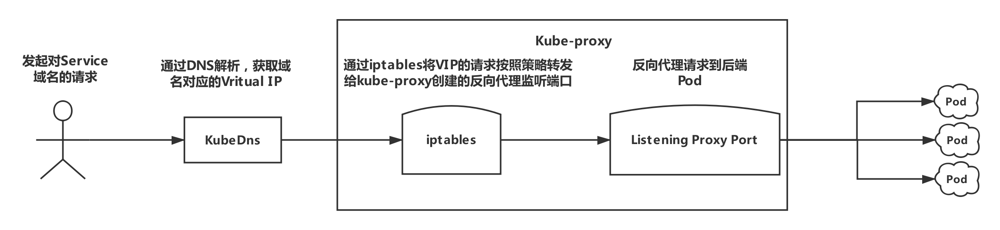
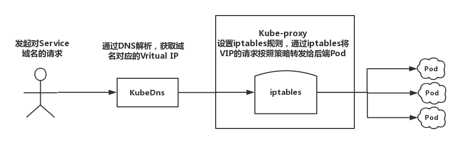
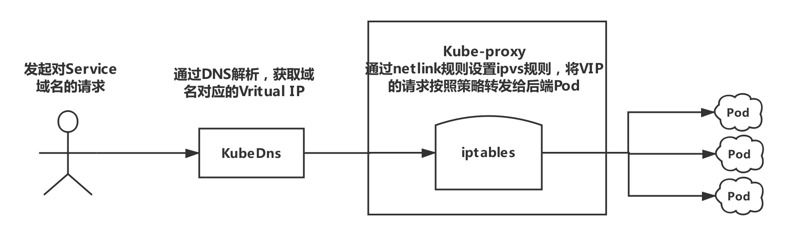

# kube-proxy 工作原理

# 概念

Kubernetes 在每个节点上运行网络代理。这反映每个节点上 Kubernetes API 中定义的服务，并且可以做简单的 TCP 和 UDP 流转发或在一组后端中轮询，进行 TCP 和 UDP 转发。目前服务集群 IP 和端口通过由服务代理打开的端口 的 Docker-links-compatible 环境变量找到。有一个可选的为这些集群 IP 提供集群 DNS 的插件。用户必须 通过 apiserver API 创建服务去配置代理。

# 
一、**kube-proxy 监听 API server 中 service 和 endpoint 的变化情况，并通过 userspace、iptables、ipvs 或 winuserspace 等 proxier 来为服务配置负载均衡（仅支持 TCP 和 UDP）。**

- kube-proxy 其实就是管理 Service 的访问入口，包括集群内 Pod 到 Service 的访问和集群外访问 Service；
- kube-proxy 管理 Service 的 Endpoints，该 Service 对外暴露一个 Virtual IP，也称为 Cluster IP, 集群内通过访问这个  Cluster IP:Port 就能访问到集群内对应的 Serivce 下的 Pod；
- Service 是通过 Selector 选择的一组 Pods 的服务抽象，其实就是一个微服务，提供了服务的 LB 和反向代理的能力，而 kube-proxy 的主要作用就是负责 Service 的实现；
- Service 一个重要作用就是，一个服务后端的 Pods 可能会随着生存灭亡而发生 IP 的改变，Service 的出现，给服务提供了一个固定的 IP，而无视后端 Endpoint 的变化，而这种关联的维护主要依赖 kube-proxy 实现；

# 二、kube-proxy 内部原理
**kube-proxy 当前实现了三种代理模式：~~userspace、iptables~~以及ipvs，但是最新的实现方式是ipvs方式，也是kube默认的方式。**

---
## 1、  userspace 模式

在这种模式下，kube-proxy 持续监听 Service 以及 Endpoints 对象的变化；
对每个 Service，它都为其在本地节点开放一个端口，作为其服务代理端口；
发往该端口的请求会采用一定的策略转发给与该服务对应的后端 Pod 实体。
kube-proxy 同时会在本地节点设置 iptables 规则，配置一个 Virtual IP，
把发往 Virtual IP 的请求重定向到与该 Virtual IP 对应的服务代理端口上。
其工作流程大体如下：

分析：该模式请求在到达 iptables 进行处理时就会进入内核，而 kube-proxy 监听则是在用户态，请求就形成了从用户态到内核态再返回到用户态的传递过程，一定程度降低了服务性能。

## 2、iptables 模式

kube-proxy 持续监听 Service 以及 Endpoints 对象的变化；
但它并不在本地节点开启反向代理服务，而是把反向代理全部交给 iptables 来实现；即 iptables 直接将对 VIP 的请求转发给后端 Pod，通过 iptables 设置转发策略。
其工作流程大体如下：

分析：该模式相比 userspace 模式，克服了请求在用户态-内核态反复传递的问题，性能上有所提升，但使用 iptables NAT 来完成转发，存在不可忽视的性能损耗，而且在大规模场景下，iptables 规则的条目会十分巨大，性能上还要再打折扣。

## 3、ipvs 模式

 与 iptables、userspace 模式一样，kube-proxy 依然监听 Service 以及 Endpoints 对象的变化；不过它并不创建反向代理，也不创建大量的 iptables 规则；而是通过 netlink 创建 ipvs 规则，并使用 k8s Service 与 Endpoints 信息，对所在节点的 ipvs 规则进行定期同步；netlink 与 iptables 底层都是基于 netfilter 钩子，但是 netlink 由于采用了 hash table 而且直接工作在内核态，在性能上比 iptables 更优。

分析：ipvs 是目前 kube-proxy 所支持的最新代理模式，相比使用 iptables，使用 ipvs 具有更高的性能。

# 三、ipvs
**什么是 IPVS ?**

IPVS (IP Virtual Server)是在 Netfilter 上层构建的，并作为 Linux 内核的一部分，实现传输层负载均衡。

IPVS 集成在 LVS（Linux Virtual Server，Linux 虚拟服务器）中，它在主机上运行，并在物理服务器集群前作为负载均衡器。IPVS 可以将基于 TCP 和 UDP 服务的请求定向到真实服务器，并使真实服务器的服务在单个IP地址上显示为虚拟服务。 因此，IPVS 自然支持 Kubernetes 服务。

**为什么为 Kubernetes 选择 IPVS ?**

随着 Kubernetes 的使用增长，其资源的可扩展性变得越来越重要。特别是，服务的可扩展性对于运行大型工作负载的开发人员/公司采用 Kubernetes 至关重要。

Kube-proxy 是服务路由的构建块，它依赖于经过强化攻击的 iptables 来实现支持核心的服务类型，如 ClusterIP 和 NodePort。 但是，iptables 难以扩展到成千上万的服务，因为它纯粹是为防火墙而设计的，并且基于内核规则列表。

尽管 Kubernetes 在版本v1.6中已经支持5000个节点，但使用 iptables 的 kube-proxy 实际上是将集群扩展到5000个节点的瓶颈。 一个例子是，在5000节点集群中使用 NodePort 服务，如果我们有2000个服务并且每个服务有10个 pod，这将在每个工作节点上至少产生20000个 iptable 记录，这可能使内核非常繁忙。

另一方面，使用基于 IPVS 的集群内服务负载均衡可以为这种情况提供很多帮助。 IPVS 专门用于负载均衡，并使用更高效的数据结构（哈希表），允许几乎无限的规模扩张。

# 三、ipvs原理

**ipvs的模型中有两个角色：**
调度器:Director，又称为Balancer。 调度器主要用于接受用户请求。

真实主机:Real Server，简称为RS。用于真正处理用户的请求。
**
IP地址类型分为三种：**
Client IP:客户端请求源IP，简称CIP。

Director Virtual IP:调度器用于与客户端通信的IP地址，简称为VIP。

Real Server IP: 后端主机的用于与调度器通信的IP地址，简称为RIP。
--------------------- 
作者：田园园野 
来源：CSDN 
原文：https://blog.csdn.net/qq_36183935/article/details/90734936 
版权声明：本文为博主原创文章，转载请附上博文链接！
**kube-proxy引入了IPVS，IPVS与iptables基于Netfilter，但IPVS采用的hash表，因此当service数量规模特别大时，hash查表的速度优势就会突显，而提高查找service性能。**

ipvs ： 工作于内核空间，主要用于使用户定义的策略生效；
ipvsadm : 工作于用户空间，主要用于用户定义和管理集群服务的工具；

